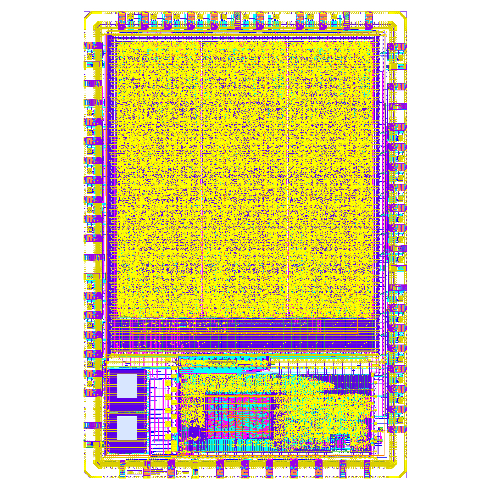

# Caravel Plus
Caravel management SoC attached to the largest possible DFFRAM that can fit the user's area. For the RAM related development, refer to [DFFRAM](https://github.com/shalan/DFFRAM)

# Caravel Integration

## Verilog View

The DFFRAM macro is placed on the management area wishbone bus at address (0x30000000). For the memory interface and wishbone bus conversion, refer to [Caravel_RAM_24KB_wb](https://github.com/shalan/Caravel_Plus/blob/master/verilog/rtl/Caravel_RAM_24KB_wb.v)

## GDS View

